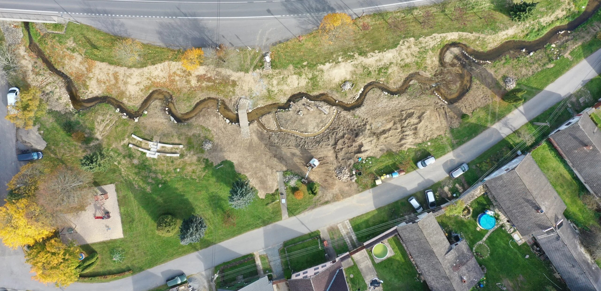
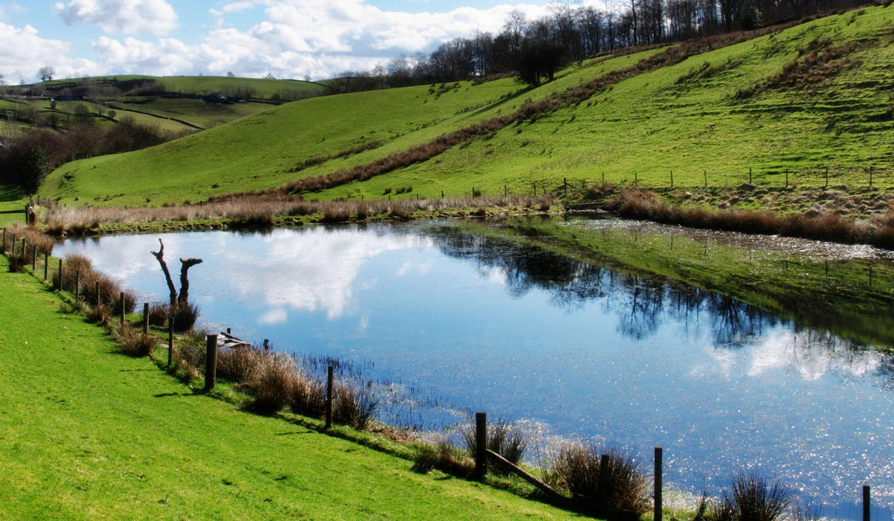
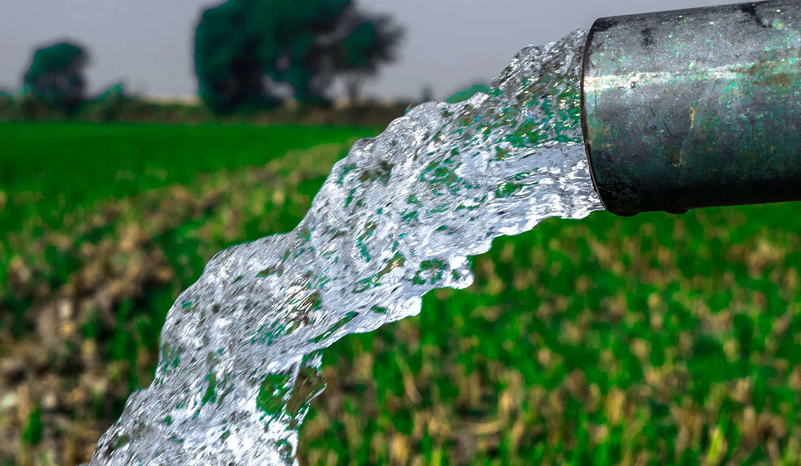
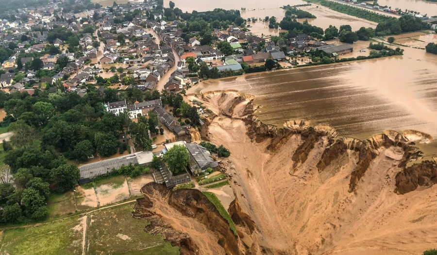
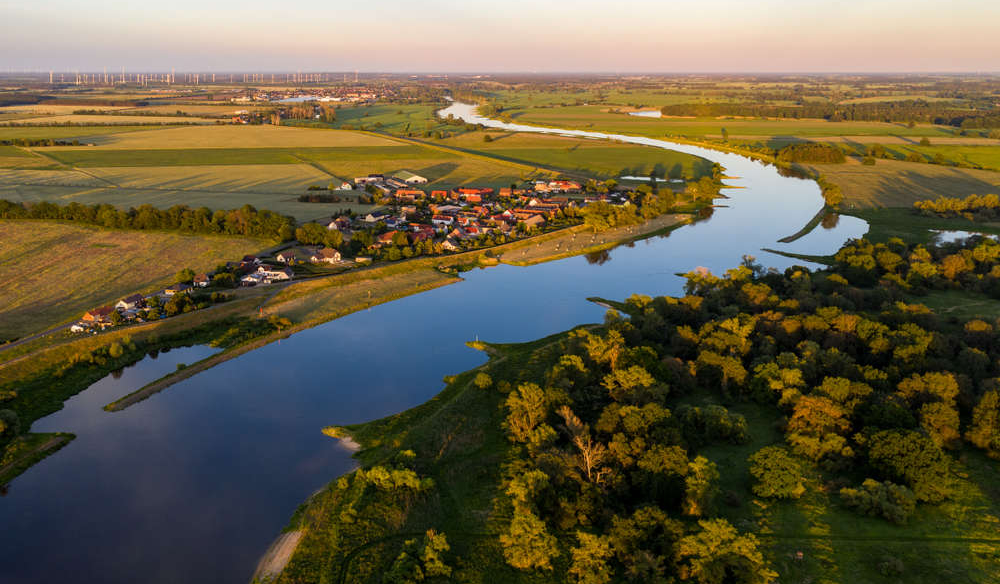
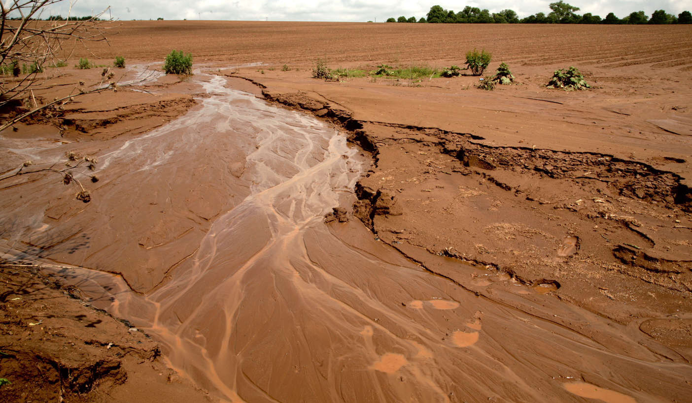
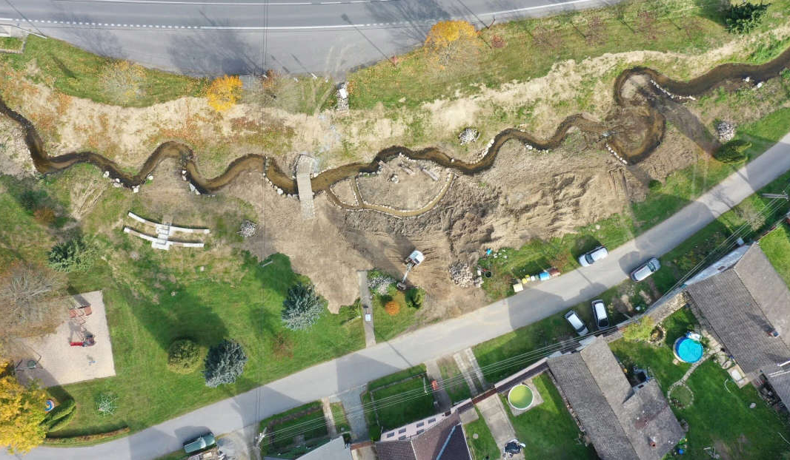
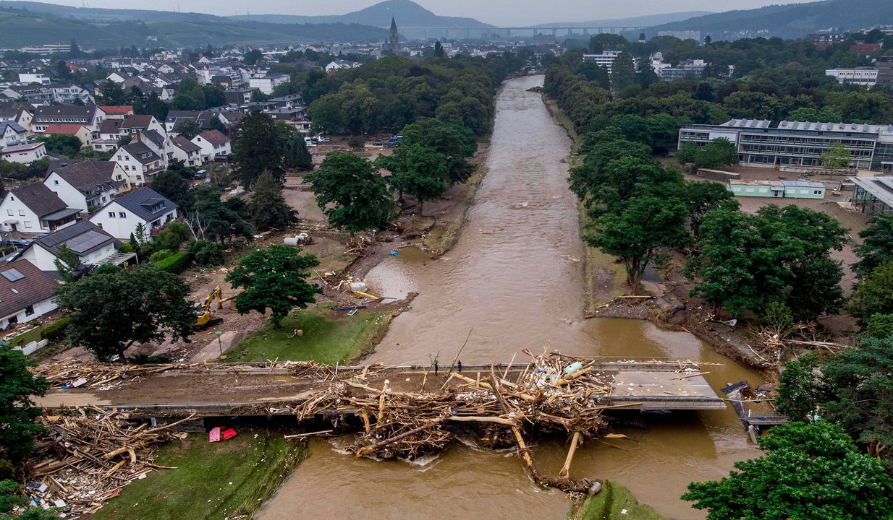
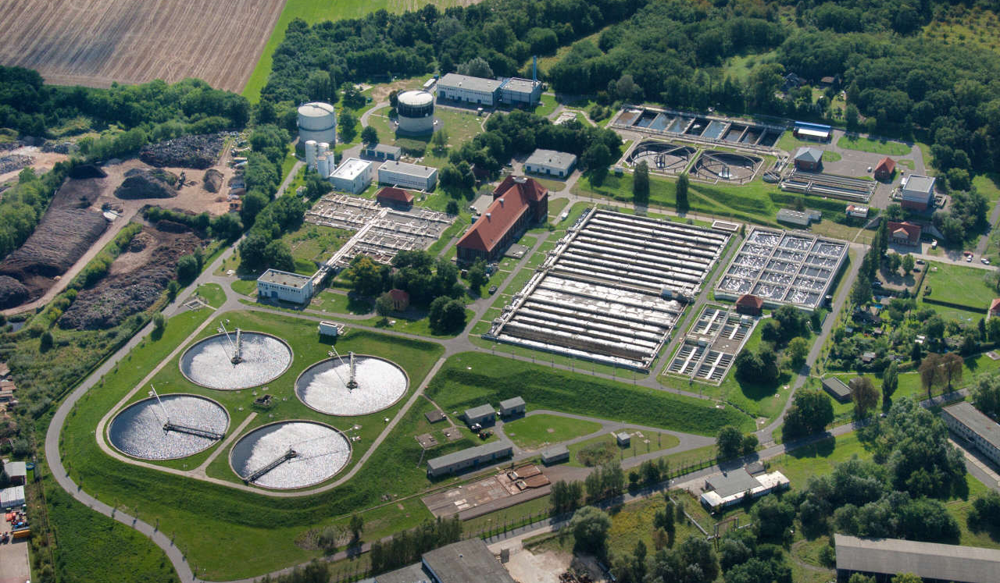

# Adaptace krajiny na klimatickou změnu {: .page_title}

Tento web slouží jako __podpůrný materiál k přípravě__ na bakalářský studijní program [__Stavby, krajina a životní prostředí__](https://krajina.fsv.cvut.cz/){ .external_link_icon .underlined } na [Fakultě stavební ČVUT v Praze](https://krajina.fsv.cvut.cz/){ .external_link_icon }. Provede vás __základními úlohami ze světa geografických informačních systémů (GIS) v návaznosti na chování vody v krajině__.

<!-- <figure markdown>

</figure> -->

{: .no-filter }
{: .no-filter }
{: .no-filter }
{: .no-filter }
{: .no-filter }
{: .no-filter }
{: .no-filter }
{: .no-filter }

<h2 style="text-align:center;">Naučíte se</h2>
<!-- styl je zde pridany HTML tagem (ne pomoci '##'), aby se text neobjevil v tabulce obsahu vlevo na strance -->

 <!-- specificky format gridu (trida "grid_icon_info") na miru uvodni strance predmetu -->

-   :material-database-import-outline:{ .xl }

    pracovat s __geoprostorovými daty__ vašeho města

-   :octicons-gear-16:{ .xl }

    __základní zpracování__ a __analýzu__ geoprostorových dat

-   :material-printer-3d-nozzle:{ .xl }

    základy __3D tisku__ krajiny

-   :material-file-document-outline:{ .xl }

    vytvářet vlastní __mapy__ 

## Úlohy

[:material-presentation: &nbsp; Úvod do tématu prostorových dat](/ulohy/01-uvod-do-gis){ .md-button .md-button--primary }
{align=center}

[:simple-qgis: &nbsp; Program QGIS](/ulohy/02-program-qgis){ .md-button .md-button--primary }
{align=center}

[:fontawesome-solid-layer-group: &nbsp; Webové mapové služby v prohlížeči](/ulohy/03-webove-sluzby-v-prohlizeci){ .md-button .md-button--primary }
{align=center}

[:material-monitor-dashboard: &nbsp; Práce s webovými mapovými službami](/ulohy/04-webove-sluzby-v-qgis){ .md-button .md-button--primary }
{align=center}

[:material-printer-3d-nozzle: &nbsp; 3D tisk území](/ulohy/05-3D_tisk){ .md-button .md-button--primary }
{align=center}

      