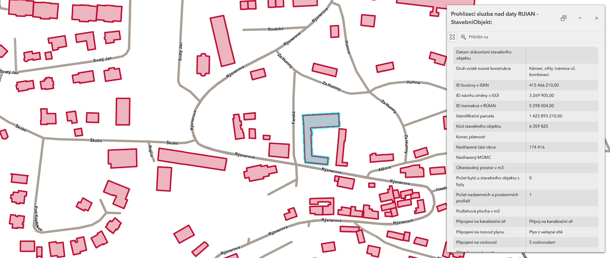

{: .no-filter }
{: .no-filter }
{: .no-filter }
{: .no-filter }

## Cíle cvičení

 <!-- specificky format gridu (trida "grid_icon_info") na miru uvodni strance predmetu -->

-   :material-shape-plus-outline:{ .xl }

    jaké existují __základní typy__ geoprostorových dat

-   :material-table-eye:{ .xl }

    co je __atributová tabulka__ a k čemu slouží

-   :material-layers-triple-outline:{ .xl }

    práce s __webovými mapovými službami__

-   :material-server-network:{ .xl }

    jak využívat __geoportály__

## Geoprostorová data a atributy
Geoprostorová data (někdy také geodata) jsou data, která obsahují __informaci o konkrétní geografické poloze objektů na Zemi__. Poloha může být určena __přímo__ (souřadnice objektu) či __nepřímo__ (např. adresou). Dvěma nejběžnějšími typy geoprostorových dat jsou data __vektorová (body, linie, plochy)__ a __rastrová (satelitní snímky, digitální modely terénu)__. V případě dat vektorových bývají k samotné poloze obvykle připojeny doplňkové informace ve formě tzv. __atributové tabulky__.

### Základní typy dat

-   :material-vector-polyline:{ .lg .middle } __Vektorová data__

    ---

    Reprezentují prvky pomocí základních geometrických elementů: __:material-vector-point: bodů, :material-vector-polyline: linií a :material-vector-rectangle: ploch__ (tzv. polygonů)

    Podrobnost dat je určena __podrobností souřadnic vrcholů__ geometrického prvku

    Vhodné pro modelování a analýzu __diskrétních objektů__ (např. rozhledny, silniční síť, plochy krajů ČR)

    Možné problémy s __topologií__ (mezery a překryvy polygonů, špatně napojené lomové body)

    Základními formáty vektorových dat jsou __Esri Shapefile, GeoJSON, GeoPackage__ či __KML/GML__

    ---

    { width=200px .no-filter }
    { width=200px .no-filter }
    { width=200px .no-filter }
    {align=center}

-   :material-grid:{ .lg .middle } __Rastrová data__

    ---

    Reprezentují prvky (častěji však souvislou plochu) v podobě pravidelné mřížky tvořené tzv. __pixely__

    Podrobnost dat je určena __prostorovým rozlišením__ rastru, tj. __velikostí__ hrany __pixelu__ (v metrech)

    Vhodné pro modelování a analýzu __spojitých jevů__ (nadmořská výška, teplota, srážky)
    
    Využívané pro __obrazová data__ (např. ortofotomapy, satelitní snímky)

    Základními formáty rastrových dat jsou __GeoTIFF, JPEG, PNG__ či __GIF__

    ---

    <!-- { width=200px .no-filter }
    { width=200px .no-filter }
    { width=200px .no-filter } -->
    { width=200px .no-filter }
    { width=200px .no-filter }
    { width=200px .no-filter }
    {align=center}

<!-- <figure markdown>
{ width=400px }
<figcaption>Rozdíl v grafické reprezentaci vektorových a rastrových dat (Geletič et al. 2019)</figcaption>
</figure> -->

---

### Atributová tabulka (vektorová data)

<!-- ???+ info-fg-color "Atributy (geo)prostorových dat" -->

Podstatnou částí vektorových geoprostorových dat jsou atributy. Jedná se o __doplňkové informace přiřazené ke každému prvku__ a uspořádané ve formě tzv. __atributové tabulky__. Sloupce této tabulky jsou tzv. __:octicons-columns-16: atributy__, řádky jsou tzv. __:octicons-rows-16: záznamy__. Každý atribut má svůj __název__ a __datový typ__ (např. celé číslo, des. číslo, text, datum). V záznamu nemusí být nutně vyplněny všechny atributy (záleží na nastavení databáze).

=== "CELÁ MAPA"

    {.no-filter width="500"}
    {align=center}

    <figcaption>Schematická ukázka geoprostorových dat a k nim přiřazených atributových tabulek</figcaption>

=== "Body"
    
    {.no-filter width="500"}
    {align=center}

    <figcaption>Schematická ukázka geoprostorových dat a k nim přiřazených atributových tabulek</figcaption>

=== "Linie"

    {.no-filter width="500"}
    {align=center}

    <figcaption>Schematická ukázka geoprostorových dat a k nim přiřazených atributových tabulek</figcaption>

=== "Polygony"

    {.no-filter width="500"}
    {align=center}

    <figcaption>Schematická ukázka geoprostorových dat a k nim přiřazených atributových tabulek</figcaption>

<!-- {width=50% .no-filter}
{align="center"} -->

Zobrazování atributů konkrétního prvku probíhá nejčastěji formou tzv. __vyskakovacího okna__ (pop-up window). Tento prvek uživatelského rozhraní se __objeví po kliknutí na prvek v mapě__ a ve výchozím stavu zobrazuje __tabulku s atributy pro daný prvek__.  Atributy se v geomatice používají pro __filtrování prvků__ (zobrazení/skrytí) nebo __řízení symbologie__ (např. obarvení budov podle počtu podlaží).

{width=50% .no-filter}
{align="center"}

<figcaption>vyskakovací okno (po kliknutí na prvek)</figcaption>

<!--
<iframe width="100%" height="400" frameborder="0" scrolling="no" marginheight="0" marginwidth="0" src="https://experience.arcgis.com/experience/0d0ade6e797e419d8e73fd28b8704c5a"></iframe>
-->

<!--
style="border: .05rem solid #ededed; border-radius: .1rem;"-->

## Mapové služby

Mapové služby jsou __webové nástroje poskytující geoprostorová data__ ze serveru na klienta __prostřednictvím internetu__. Klientem je (zjednodušeně) zařízení uživatele (např. webový prohlížeč) vysílající požadavek pro získání dat ze serveru. V praxi se většinou __klient služby dotazuje pomocí GIS aplikace__ (webové či desktopové), která na pozadí posílá serveru požadavky a následně zobrazuje přijatá data (viz obrázek). Díky vazbě dat na souřadnicový systém lze takto __kombinovat data s různými rozsahy a z různých zdrojů v jednom mapovém okně__ a data se zobrazí polohově správně.

{ .no-filter width=700px}
{align=center}

Pro mapové služby existují různé __standardy komunikace__:

- [OGC]("Open Geospatial Consortium") otevřené formáty: 
    - __WMS (Web Map Service)__: umožňuje sdílení geografické informace ve formě rastrových dat v prostředí Internetu
    - __WFS (Web Feature Service)__: umožňuje sdílení geografické informace ve formě vektorových dat v prostředí Internetu

- proprietární od společnosti [Esri]("ESRI (Environmental Systems Research Institute) je společnost zabývající se vývojem softwaru určeného pro práci s geografickými informačními systémy"):
    - __ArcGIS REST__

Pro dané služby je vhodné __znát standard, ve kterém je poskytována__.

???+ info-fg-color "Kde hledat mapové služby?"
    - geoportály (viz níže)
    - webové stránky poskytovale (např. [Evropská agentura pro životní prostředí (EEA)](https://land.copernicus.eu/en/products/corine-land-cover?tab=main){ .color_def .underlined_dotted .external_link_icon target="_blank"})
    

## Geoportály

Geoportály jsou webové stránky, které poskytují přístup k geografickým datům a službám. Slouží jako __centrální bod pro vyhledávání, prohlížení a stahování prostorových informací__, jako jsou mapy, letecké snímky, katastrální data nebo údaje o životním prostředí. Mohou představovat cenný zdroj dat pro analýzu a plánování projektů. Lze zde například využít data o reliéfu terénu, dopravní infrastruktuře nebo vlastnických vztazích k pozemkům. Geoportály často nabízejí i nástroje pro prostorovou analýzu a vizualizaci dat, což může pomoci lépe porozumět kontextu projektů. 
Geoportály v širším slova smyslu představují také důležitý nástroj v územním plánování a správě měst. Umožňují veřejnosti i odborníkům přístup k aktuálním a relevantním informacím o daném území. Uživatelé mohou využít geoportály k __získání podkladů pro své projekty__, ale také k prezentaci svých návrhů veřejnosti. Díky geoportálům se stává územní plánování transparentnější a efektivnější, což přispívá k lepšímu rozvoji měst a regionů.

{ width=400px }
{ align=center }

__Tipy na zajímavé geoportály:__

[Geoportál ČÚZK](https://geoportal.cuzk.cz/ "Český úřad zeměměřický a katastrální"){ .md-button .md-button--primary .button_smaller .external_link_icon target="_blank"}
[Geoportál AOPK](https://gis-aopkcr.opendata.arcgis.com/ "Agentura přírody a krajiny"){ .md-button .md-button--primary .button_smaller .external_link_icon target="_blank"}
[Geoportál ČSÚ](https://geodata.statistika.cz/portal/apps/sites/#/homepage "Český statistický úřad"){ .md-button .md-button--primary .button_smaller .external_link_icon target="_blank"}
[Geoportál Praha](https://geoportalpraha.cz/ "IPR Praha"){ .md-button .md-button--primary .button_smaller .external_link_icon target="_blank"}
[Geoportál města Brna](https://data.brno.cz/ "Magistrát města Brna"){ .md-button .md-button--primary .button_smaller .external_link_icon target="_blank"}
{.button_array}

## QGIS :simple-qgis:

[__QGIS__](https://qgis.org/){.color_def .underlined_dotted .external_link_icon target="_blank"} je bezplatný desktopový open-source software pro geografické informační systémy (GIS). Je to velmi pokročilý nástroj pro __tvorbu, úpravu, analýzu a vizualizaci__ map a geoprostorových dat. Lze pomocí něho __tvořit mapy__ (přidávat data a aplikovat symboliku), ale i __hromadně upravovat__ podkladová data (tzv. analyzovat).

Program lze stáhnout a nainstalovat na __[této adrese](https://qgis.org/download/){.underlined .external_link_icon}__. Pro maximální stabilitu je doporučeno instalovat verzi "__Long Term Version (LTR)__".

Úkoly v rámci tohoto webu jsou optimalizované pro postup v programu QGIS.

