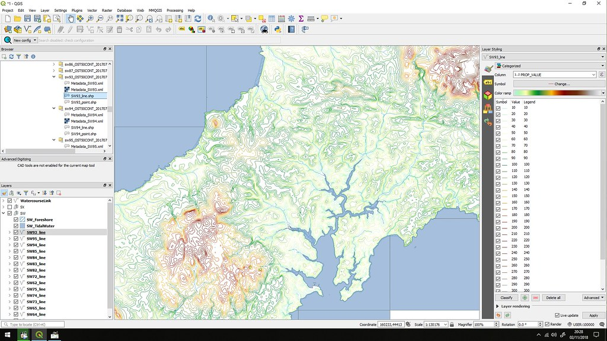

<h2 style="text-align:center;">QGIS – práce s otevřeným GIS softwarem</h2>

- :fontawesome-solid-map-location-dot:{ .xl }  

    __seznámení s prostředím__ open-source GIS programu QGIS  

- :material-database-outline:{ .xl }  

    __načítání a práce s daty__ z různých zdrojů (vektorová i rastrová)  

- :material-map-check-outline:{ .xl }  

    __vizualizace a analýza prostorových dat__  

- :material-file-export-outline:{ .xl }  

    __vytvoření mapové kompozice__ a její export do PDF  

<!-- <h3 style="text-align:center;">Co je QGIS</h3> -->

## Co je QGIS

[__QGIS (Quantum GIS)__](https://qgis.org/){.color_def .underlined_dotted .external_link_icon target="_blank"} je __otevřený a bezplatný geografický informační systém (GIS)__ určený pro práci s prostorovými daty.  
Umožňuje __vytvářet, upravovat, analyzovat a vizualizovat geografická data__ podobně jako profesionální komerční systémy (např. ArcGIS).  
QGIS využívají nejen studenti a vědci, ale také odborníci z praxe — například v oblasti __geodézie, stavebnictví, územního plánování__ nebo __ochrany životního prostředí__.  

Program běží na všech běžných operačních systémech (Windows, macOS, Linux) a díky své otevřenosti podporuje širokou škálu datových formátů a služeb (např. __Shapefile, GeoPackage, GeoJSON, WMS, WFS__ aj.).  

{ width="800" }
{align=center}

<figcaption>Uživatelské rozhraní QGIS – příklad mapového projektu s vektorovými vrstvami</figcaption>

<!-- <h3 style="text-align:center;">Využití v geomatice a stavebnictví</h3> -->

## Využití v geomatice a stavebnictví

QGIS má významné uplatnění i ve studijních programech Fakulty stavební ČVUT, zejména v oborech [__Geodézie a kartografie__](https://geomatics.fsv.cvut.cz/) a [__Stavby, krajina a životní prostředí__](https://krajina.fsv.cvut.cz/).  
Studenti zde mohou pomocí QGIS:

- analyzovat prostorové vztahy (např. __vzdálenosti, překryvy, plochy__),  
- vytvářet tematické mapy (např. __geologické podloží, druhy využití území__),  
- kombinovat data z různých zdrojů (např. __katastrální mapy, ortofoto, data o dopravní infrastruktuře__),  
- modelovat dopady stavebních záměrů na __krajinu či životní prostředí__.  

QGIS tak pomáhá propojit teoretické znalosti s praktickým využitím dat při __navrhování staveb__, __územní analýze__ nebo __hodnocení environmentálních dopadů__.  

<h3 style="text-align:center;">Proč QGIS?</h3>

- :material-lock-open-outline:{ .lg .middle } __Otevřený software__  
  Bez licenčních poplatků, volně dostupný a podporovaný rozsáhlou komunitou uživatelů a vývojářů.

- :simple-gitextensions:{ .lg .middle } __Rozšiřitelnost pomocí pluginů__  
  Pomocí doplňků lze přidávat nové funkce – např. propojení s CAD formáty, analýzy viditelnosti nebo export dat do 3D.

- :material-earth:{ .lg .middle } __Podpora webových mapových služeb__  
  Snadné připojení k datům z geoportálů, např. [ČÚZK](https://geoportal.cuzk.cz/){.external_link_icon target="_blank"} nebo [AOPK ČR](https://gis-aopkcr.opendata.arcgis.com/){.external_link_icon target="_blank"}.

- :material-map-search-outline:{ .lg .middle } __Vizuální analýzy__  
  Přehledná tvorba map, symbolika podle atributů, průhlednost vrstev či tisk mapových výstupů do PDF.

<h3 style="text-align:center;">Tipy pro začátek</h3>

- nainstalujte aktuální verzi z [__oficiálních stránek QGIS__](https://qgis.org/){.color_def .underlined_dotted .external_link_icon target="_blank"}  
- doporučené formáty pro práci: __GeoPackage__ (moderní a univerzální), případně __Shapefile__  
- zobrazení dat z webových zdrojů: nabídka __„Vrstva → Přidat vrstvu → Přidat WMS/WMTS nebo WFS“__  
- využijte __panel „Tiskové kompozice“__ k vytvoření mapového výstupu s měřítkem, legendou a titulkem  

<h3 style="text-align:center;">Shrnutí</h3>

QGIS představuje __dostupný a výkonný nástroj pro práci s geografickými daty__, vhodný jak pro výuku, tak pro praktické využití v technických a environmentálních oborech.  
Můžeme si díky němu vyzkoušet celý proces tvorby map — od načtení dat, přes jejich zpracování a analýzu až po finální kartografický výstup.  

<!-- 3 obrázky vedle sebe s mezerami, responsivní -->

  <figure style="margin:0; flex:1 1 280px; max-width:600px;">
    
  </figure>
  <figure style="margin:0; flex:1 1 280px; max-width:600px;">
    
  </figure>
  <figure style="margin:0; flex:1 1 280px; max-width:600px;">
    
  </figure>

       

