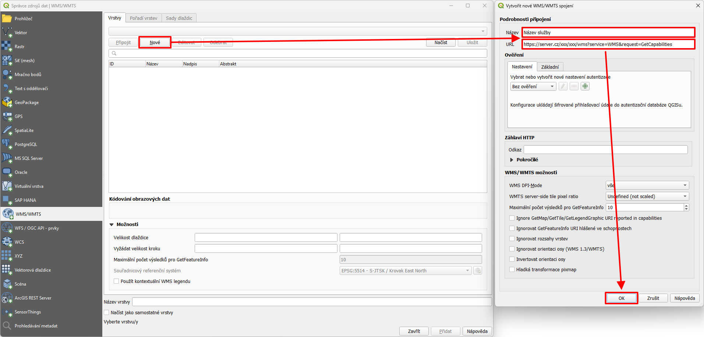
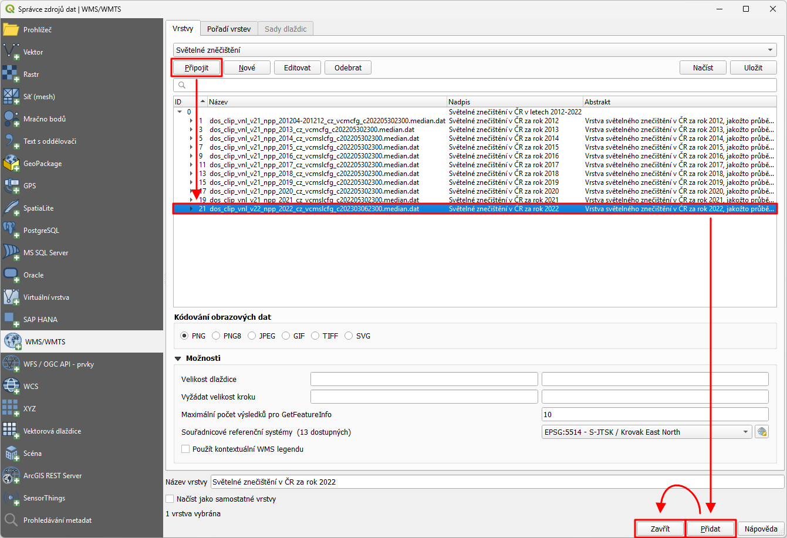
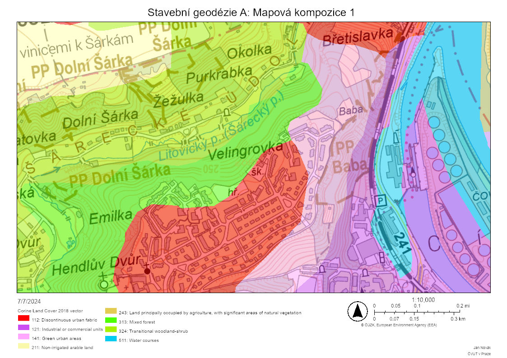
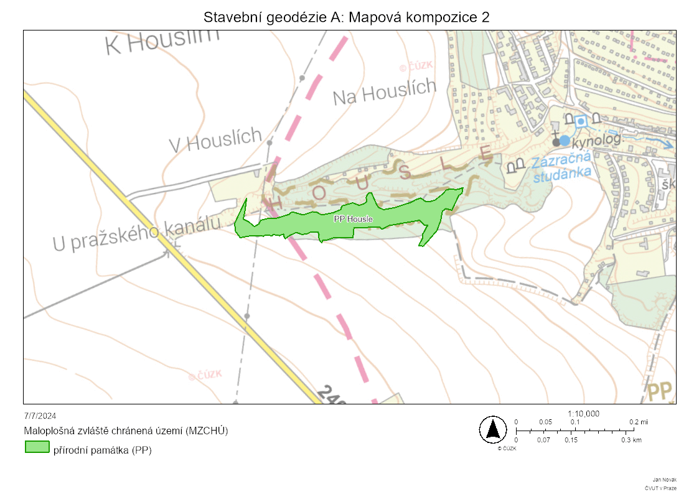
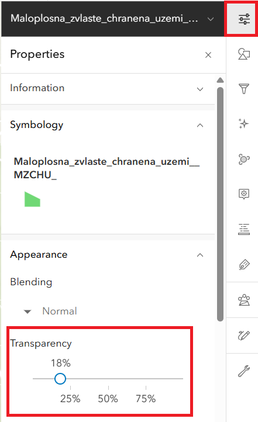
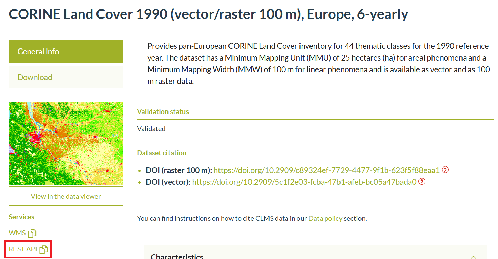
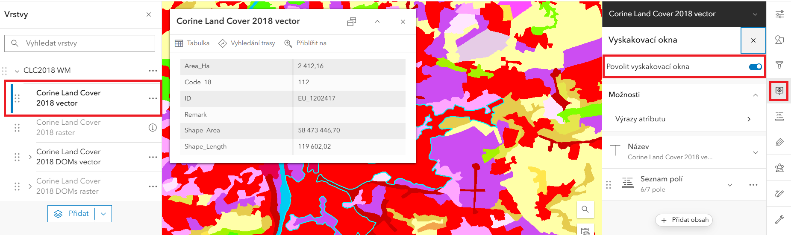
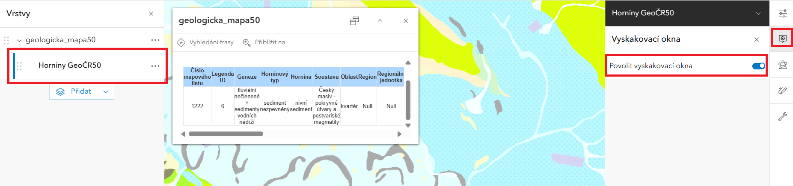

## Cíle cvičení

 <!-- specificky format gridu (trida "grid_icon_info") na miru uvodni strance predmetu -->

-   :fontawesome-regular-handshake:{ .xl }

    __seznámení s prostředím__ desktopového programu QGIS

-   :material-layers-plus:{ .xl }

    __přidání mapových služeb__ do mapy

-   :material-map-marker-plus-outline:{ .xl }

    __extrakce informací__ z více vrstev ke konkrétnímu místu

-   :material-lightbulb-on-10:{ .xl }

    __shrnutí a interpretace__ získaných informací

## QGIS a připojení mapových služeb

[__QGIS__](https://qgis.org/){.color_def .underlined_dotted .external_link_icon target="_blank"} je bezplatný open-source software pro geografické informační systémy (GIS). Je to velmi pokročilý nástroj pro tvorbu, úpravu, analýzu a vizualizaci map a geoprostorových dat. Lze pomocí něho tvořit mapy (přidávat data a aplikovat symboliku), ale i hromadně upravovat podkladová data (tzv. analyzovat).

__Mapová služba__ je webové rozhraní umožňující sdílení geoprostorových dat bez nutnosti jejich stahování ve formě souborů. Díky tomuto rozhraní je možné velmi rychle připojit vhodná data a stahovat pouze ty části (dlaždice), které ma uživatel aktuálně na obrazovce.

### Přidávání mapových služeb do QGIS

U přidávání mapových služeb je důležité vědět, o jaký typ (standard komunikace) se jedná. V rámci tohoto cvičení jsou použity 3 typy služeb: __WMS__{.bg}, __WFS__{.bg} a __ArcGIS REST__{.bg}.

Samotné přidání služby se provede v menu _:material-button-cursor: Vrstva_{: .outlined_code} → _:material-button-cursor: Přidat vrstvu_{: .outlined_code} a dále příslušné tlačítko podle typu dané služby.

{: .off-glb .process_icon}

{: .off-glb .process_icon}

{: .process_container}

Rozhraní různých typů služeb jsou si podobná – vždy je nutné nejdříve __vytvořit nové připojení__ ke službě (tlačítko  _:material-button-cursor: Nové_{: .outlined_code}), potom vložit název služby (název je zde pouze pro orientaci uživatele v případě, že služeb připojí v budoucnu více) a URL adresu. Následně se musí uživatel ke konkrétní službě _:material-button-cursor: Připojit_{: .outlined_code}, vybrat jednu (či více) z vrstev a _:material-button-cursor: Přidat_{: .outlined_code}) ji do mapy. Dále lze dialog _:material-button-cursor: Zavřít_{: .outlined_code}), nová vrstva služby bude přidána v mapě.

## Zadání úlohy

Je zadán __bod o zeměpisných souřadnicích__ dle individuálního zadání:

| číslo zadání | Zeměpisná šířka (° ' '') |   |   | Zeměpisná délka (° ' '') |   |   |
| ------------ | ------------------------ | - | - | ------------------------ | - | - |
|       1      |    50   |    37   |    38,590    |    14   |    45   |    34,261    |
|       2      |    50   |    40   |    43,046    |    13   |    57   |    19,464    |
|       3      |    50   |    52   |    34,389    |    14   |    29   |    11,485    |
|       4      |    49   |     6   |     6,627    |    16   |    13   |    27,818    |
|       5      |    50   |    41   |    33,743    |    15   |    34   |    30,465    |

<!-- ??? task-fg-color "Individuální zadání"
    - také viz [Moodle](https://moodle-vyuka.cvut.cz/mod/page/view.php?id=363759){.color_def .underlined_dotted .external_link_icon target="_blank"}  
    <iframe src="https://docs.google.com/spreadsheets/d/e/2PACX-1vRxRPIWMyUuEA30Y8UhDF8f-T56L_N9MBSQeZ5eaw8GshZeA9MeO4aFCUhp3AnsT65sS3914Sjd8elH/pubhtml?gid=0&single=true" width="100%" height="500" frameBorder="0"></iframe> -->

---

S využitím __programu QGIS__ a __mapových služeb__ či __geoportálů__ o zadaném bodu zjistěte:

1. __příslušnost k obci__ a v jakém __katastrálním území__ bod leží

    - získejte __URL adresu mapové služby__ ArcGIS REST "Mapová služba nad daty RÚIAN" z Geoportálu ČÚZK
    - vložte do mapy vrstvy __:material-layers: Obec__{.bg} a __:material-layers: KatastralniUzemi__{.bg}
    - jako odpověď uveďte hodnoty atributů __Název obce__{.outlined}, __Kód katastrálního území__{.outlined} a __Číslo katastrálního území__{.outlined}
          
---

2. __geologické podloží__ pod zadaným bodem

    - získejte __URL adresu mapové služby__ ArcGIS REST "Geologická mapa 1 : 50 000 (GEOČR50)" z webu České geologické služby (záložka "Webové služby") – pozor, URL adresa mapové služby musí obsahovat klíčové slovo "rest"
    - vložte do mapy vrstvu __:material-layers: Horniny GeoČR50__{.bg}
    - jako odpověď uveďte hodnoty atributů __hornina__{.outlined} a __horninový typ__{.outlined}

---

3. adresu nejbližšího __adresního bodu__

    - získejte __URL adresu mapové služby__ ArcGIS REST "Mapová služba nad daty RÚIAN" z Geoportálu ČÚZK
    - vložte do mapy vrstvu __:material-layers: AdresniMisto__{.bg}
    - jako odpověď uveďte hodnotu atributu __Adresa__{.outlined}

---

4. poštovní směrovací číslo nejbližší __pobočky České pošty__ (__pouze pobočky, ne výdejní boxy apod.__ – zde si vyzkoušíte funkci **filtrování dat**)

    - získejte __URL adresu mapové služby__ WFS z [tohoto odkazu](https://gis.cenia.cz/geoserver/pobocky_ceske_posty/wfs?SERVICE=WFS&request=GETCapabilities){.color_def .underlined_dotted .external_link_icon target="_blank"} (jedná se přímo o adresu služby, ne o webovou stránku)
    - vrstvě nastavte __filtr__ zobrazující pouze prvky, pro které atribut __`ZKR_NAZ_FUN`__ nabývá hodnot __`Podávací`, `Samostatná pošta Partner`, `Dodejna I`, `Dodejna II` a `Samostatná dodejna`__ __(4)__{title="přesný text filtru"}
    - jako odpověď uveďte pětimístné poštovní směrovací číslo nejbližší pobočky (hodnota atributu __PSC_ADRESY__{.outlined})

<!--

---

5. ~~__nadmořskou výšku lokality__~~

    - ~~výšku odečtěte ze __tří různých mapových podkladů__{.primary_color} a __výsledky porovnejte__~~
    - ~~doporučenými zdroji jsou např. 
    [__Základní topografické mapy ČR__](https://ags.cuzk.cz/geoprohlizec/ "obsahují vrstevnice s popisy výšky"){.color_def .underlined_dotted .external_link_icon target="_blank"}, webová aplikace 
    [__Analýzy výškopisu__](https://ags.cuzk.cz/av/ "režim Výpis souřadnic bodu (výškový systém Bpv (m))"){.color_def .underlined_dotted .external_link_icon target="_blank"} 
    (ČÚZK) nebo mapový portál 
    [__Mapy.cz__](https://mapy.cz/ "funkce Měření → Výškový profil"){.color_def .underlined_dotted .external_link_icon target="_blank"}~~
    - ~~jako odpověď uveďte __3 hodnoty nadmořské výšky včetně zdroje každé z nich__{.outlined}~~

-->

---

6. k jaké __změně využití území__ v zadaném bodě došlo mezi lety 1990 a 2018

    - využijte data evropského programu [__Copernicus__](https://www.copernicus.eu/cs "program EU pro družicové pozorování Země v zájmu obecného užitku všech občanů"){.color_def .underlined_dotted .external_link_icon target="_blank"} – __:material-layers: Corine Land Cover Europe__{.bg .color_def target="_blank"}
    - dostupné ze stránek &nbsp;[__Evropské agentury pro životní prostředí (EEA)__](https://land.copernicus.eu/en/products/corine-land-cover?tab=main){ .color_def .underlined_dotted .external_link_icon target="_blank"}&nbsp; či &nbsp;[__Copernicus Land Monitoring Service (CLMS)__](https://www.eea.europa.eu/en/datahub/datahubitem-view/a5144888-ee2a-4e5d-a7b0-2bbf21656348){ .color_def .underlined_dotted .external_link_icon target="_blank"} 
    *(Ze stránek EEA či CLMS použijte mapovou službu 'REST API', resp. 'ESRI: REST', u WMS bohužel není v tomto případě možné vyčítat hodnoty atributů vrstvy)*
    __(11)__{title="mapová služba REST"} __(12)__{title="aktivace vyskakovacích oken"}
    - jako odpověď uveďte __kód a slovní název kategorie Land Cover pro obě období__{.outlined} a __jejich slovní porovnání__{.outlined}

---
<!--
7. ~~zda dochází v lokalitě k překročení hodnoty 20 µg/m³ u roční průměrné koncentrace suspendovaných prachových částic PM10 a jakých hodnot v ng/m³ dosahují roční průměrné koncentrace benzoapyrenu (použijte službu III_5_7_8_CHMU_ovzdusi z ArcGIS Online, vrstva ČHMÚ ovzduší – Koncentrace látek znečišťujících ovzduší v gridu 1x1 km, rok 2019)~~

    - ~~využijte vrstvy od [__České informační agentury životního prostředí__](https://gis.cenia.cz/geoserver/chmu_ovzdusi/wfs?SERVICE=WFS&request=GETCapabilities "adresu odkazu lze přímo použít jako mapovou vrstvu"){.color_def .underlined_dotted .external_link_icon target="_blank"} (CENIA).~~

---
-->
7. jaké hodnoty dosahovala v zadané lokalitě __intenzita světelného znečištění__ v roce 2022

    
    - získejte __URL adresu mapové služby__ WMS __:material-layers: Světelné zněčištění__{.bg} z [tohoto odkazu](https://gis.cenia.cz/geoserver/svetelne_znecisteni/wms?service=WMS&request=GetCapabilities){.color_def .underlined_dotted .external_link_icon target="_blank"} (jedná se přímo o adresu služby, ne o webovou stránku). Poskytovatelem služby je [__Česká informační agentura životního prostředí__](https://cenia.gov.cz/){.color_def .underlined_dotted .external_link_icon target="_blank"} (CENIA)
    - jako odpověď uveďte __hodnotu intenzity znečištění z rastru__{.outlined}

    <!--  Puvodni vrstva ZDE: https://gis.cenia.cz/geoserver/svetelne_znecisteni/wms?service=WMS&request=GetCapabilities  -->

---

8. příslušnost zadané lokality ke __stavebnímu a matričnímu úřadu__

    - získejte __URL adresu mapové služby__ WFS __:material-layers: Působnost úřadů__{.bg} z [tohoto odkazu](https://gis.cenia.cz/geoserver/pusobnost_uradu/wfs?SERVICE=WFS&request=GETCapabilities){.color_def .underlined_dotted .external_link_icon target="_blank"} (jedná se přímo o adresu služby, ne o webovou stránku). Poskytovatelem služby je [__Česká informační agentura životního prostředí__](https://cenia.gov.cz/){.color_def .underlined_dotted .external_link_icon target="_blank"} (CENIA)
    - jako odpověď uveďte __název příslušného úřadu (pro oba typy instituce)__{.outlined}

&nbsp;

&nbsp;
<!--
---

DALŠÍ TIPY (nalezeno na Cenii):

Světelné znečištění: https://gis.cenia.cz/geoserver/svetelne_znecisteni/wms?service=WMS&request=GetCapabilities
Úřady: https://gis.cenia.cz/geoserver/pusobnost_uradu/wms?service=WMS&request=GetCapabilities
Školy a školská zařízení: https://gis.cenia.cz/geoserver/skoly/wms?service=WMS&request=GetCapabilities
Pobočky České pošty (je tam problém, že to bere i Pošta Partner, Balíkovny a jiná místa): https://gis.cenia.cz/geoserver/pobocky_ceske_posty/wms?service=WMS&request=GetCapabilities
Ovzduší: https://gis.cenia.cz/geoserver/chmu_ovzdusi/wms?service=WMS&request=GetCapabilities

Další zajímavé vrstvy zde (ale mám problém s popupem!): https://gis.cenia.cz/geoserver/ows?service=WMS&version=1.3.0&request=GetCapabilities

ALE POZOR! VSECHNY TY VRSTVY MAJI I WFS A TA FUNGUJE!!!
STACI PREPSAT NA: https://gis.cenia.cz/geoserver/pobocky_ceske_posty/wfs?SERVICE=WFS&request=GETCapabilities
WFS jede v AGOLu i v Geoprohlizeci (paradoxne v Procku to ma trochu problemy)

zde zajimava informace o WMS: https://community.esri.com/t5/arcgis-api-for-silverlight-questions/direct-link-to-wms-sub-layer/td-p/171686

-->

<!--
&nbsp;

__Dále vytvořte a vyexportujte mapové kompozice:__

9. využití území dle __:material-layers: CORINE Land Cover 2018__{.bg} __(3)__{title="legenda Corine Land Cover"} nad __:material-layers: Základní topografickou mapou__{.bg}, __měřítko volte 1 : 10 000__ __(10)__{title="nastavení měřítka při exportu mapy"}, __formát A4 landscape__ __(1)__{title="ukázka řešení"}

    - Základní topografická mapa je k dispozici např. na [__Geoportálu ČÚZK__](https://geoportal.cuzk.cz/ "Služby → Prohlížecí → Esri ArcGIS Server (nebo WMS)"){.color_def .underlined_dotted .external_link_icon target="_blank"}, lze ji také vyhledat v prostředí [__ArcGIS Online__](https://www.arcgis.com/ "služba 'Základní topografická mapa' od uživatele 'daniel.kolias_tonaso'"){.color_def .underlined_dotted .external_link_icon target="_blank"}
    - výchozí podkladová mapa ArcGIS Online __není součástí správného výsledku__{.primary_color}. Pro správný výsledek je nutné podkladovou mapu změnit na oficiální [__Základní topografickou mapu od Zeměměřického úřadu v souřadnicovém systému S-JTSK__]("v prostředi AGOL odpovídá službě 'Základní topografické mapy ČR (S-JTSK)' od uživatele 'Zeměměřický Úřad'"){.color_def .underlined_dotted} __(7)__{title="přidejte ZTM jako podkladovou mapu"}.

---

10. nejbližšího __maloplošného chráněného území__{.underlined_dotted title="přír. památka, přír. rezervace, nár. přír. památka, nár. přír. rezervace"} přírody (nikoli okolí Vašeho bodu, ale okolí chráněného území) __s popiskem__{.primary_color} nad __:material-layers: Základní topografickou mapou__{.bg}, __měřítko kompozice a orientaci papíru A4 volte tak, aby se dané chráněné území optimálně vešlo__ __(2)__{title="ukázka řešení"}

    - využijte vrstvu z [__Geoportálu Agentury ochrany přírody a krajiny ČR__](https://gis-aopkcr.opendata.arcgis.com/){.color_def .underlined_dotted .external_link_icon target="_blank"} (AOPK), vrstvu lze vyhledat také v prostředí [__ArcGIS Online__](https://www.arcgis.com/ "služba 'Maloplošná zvláště chráněná území' od uživatele 'aopkcr'"){.color_def .underlined_dotted .external_link_icon target="_blank"}
    - výchozí podkladová mapa ArcGIS Online __není součástí správného výsledku__{.primary_color}. Pro správný výsledek je nutné podkladovou mapu změnit na oficiální [__Základní topografickou mapu od Zeměměřického úřadu v souřadnicovém systému S-JTSK__]("v prostředi AGOL odpovídá službě 'Základní topografické mapy ČR (S-JTSK)' od uživatele 'Zeměměřický Úřad'"){.color_def .underlined_dotted} __(8)__{title="přidejte ZTM jako podkladovou mapu"}.

---

K vytvoření kompozic využijte platformu 
[__ArcGIS Online__](https://www.arcgis.com/ "pouze v ArcGIS Online lze nastavit přesné měřítko"){.color_def .underlined_dotted .external_link_icon target="_blank"}, 
[__Geoprohlížeč ČÚZK__](https://ags.cuzk.cz/geoprohlizec/){.color_def .underlined_dotted .external_link_icon target="_blank"} či 
[__Národní geoportál INSPIRE__](https://geoportal.gov.cz/web/guest/about-inspire){.color_def .underlined_dotted .external_link_icon target="_blank"} 
a __příslušné datové vrstvy__. Vrstvy prolněte __pomocí nástrojů průhlednosti vrstev__ __(9)__{title="nastavení průhlednosti vrstvy"}. Kompozice exportujte do formátu PDF či PNG (funkce Print) a __vložte do technické zprávy__.

1.  { .no-filter width=700px} vytvořeno nástrojem Print v ArcGIS Online
2.  { .no-filter width=700px} vytvořeno nástrojem Print v ArcGIS Online
3.  { .no-filter width=900px} legenda k datům Corine Land Cover
4.  `"ZKRNAZ_FUN" IN ('Podávací','Samostatná pošta Partner','Dodejna I','Dodejna II','Samostatná dodejna')`
5.  { .no-filter width=700px} funkce pro filtrování dat 
6.  { .no-filter width=700px} nastavení filtru
7.  { .no-filter width=700px} nastavení ZTM jako podkladové mapy
8.  { .no-filter width=700px} nastavení ZTM jako podkladové mapy
9.  { .no-filter width=700px} nastavení průhlednosti vrstvy
10. { .no-filter width=700px} nastavení měřítka při exportu mapy
11. { .no-filter width=700px} výběr mapové služby REST
12. { .no-filter width=700px} aktivace vyskakovacích oken
13. { .no-filter width=700px} aktivace vyskakovacích oken

-->

<!--

## Správné řešení
-->